# StockMate 📦

> Premium Inventory & Sales Management for Small Business Owners


---

## 📱 Screenshots

<table>
  <tr>
    <td>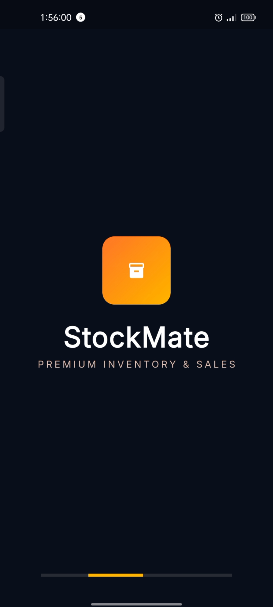</td>
    <td>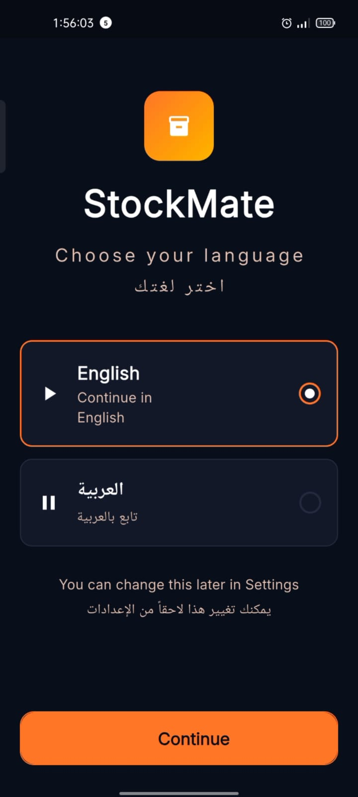</td>
    <td>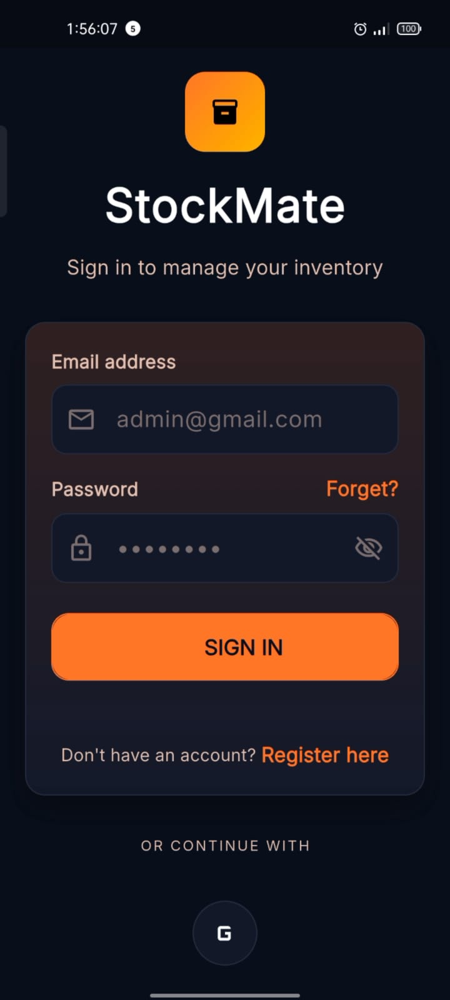</td>
    <td>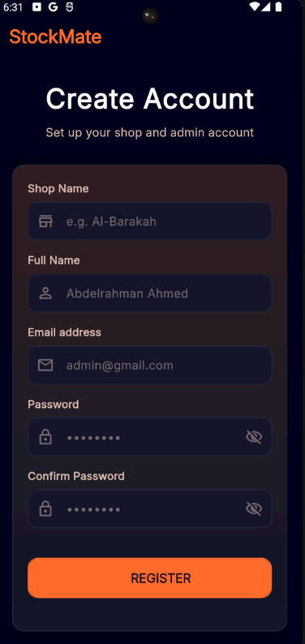</td>
  </tr>
  <tr>
    <td align="center">Splash</td>
    <td align="center">Language</td>
    <td align="center">Login</td>
    <td align="center">Register</td>
  </tr>
  <tr>
    <td>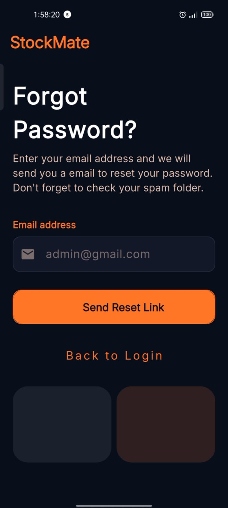</td>
    <td>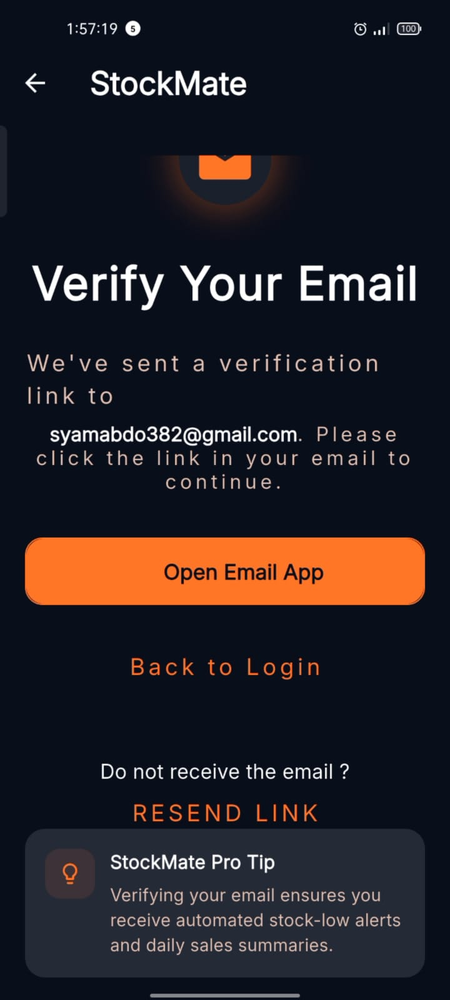</td>
    <td>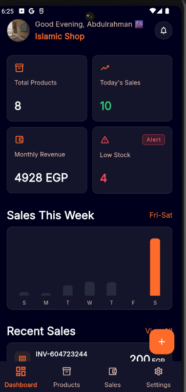</td>
    <td>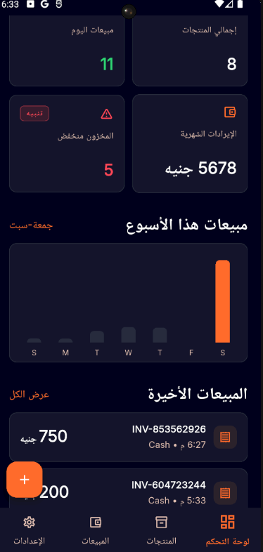</td>
  </tr>
  <tr>
    <td align="center">Forgot Password</td>
    <td align="center">Email Verification</td>
    <td align="center">Dashboard</td>
    <td align="center">Arabic (RTL)</td>
  </tr>
  <tr>
    <td>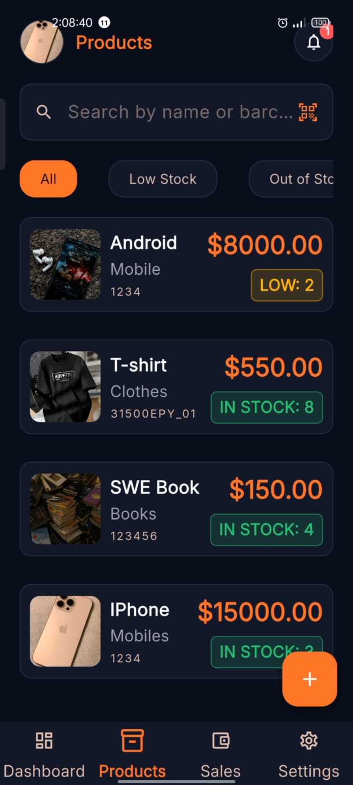</td>
    <td>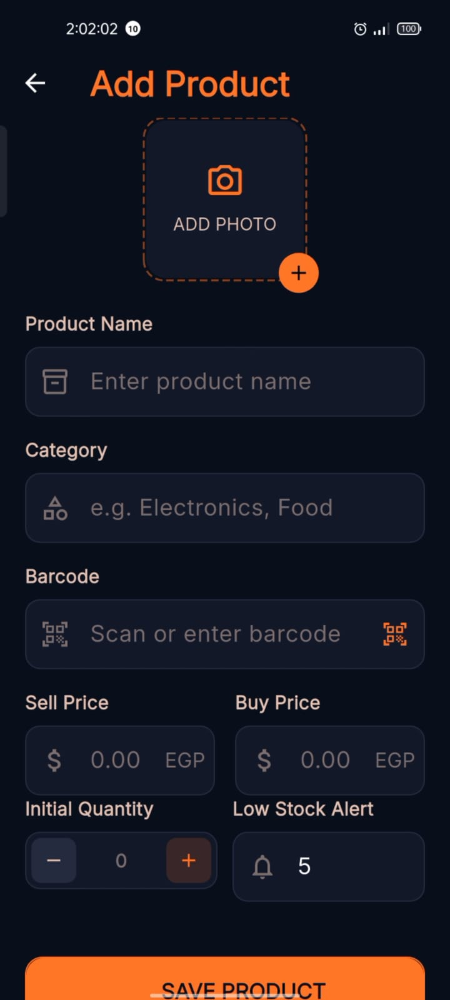</td>
    <td>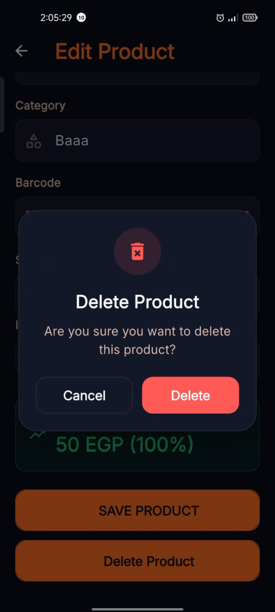</td>
    <td>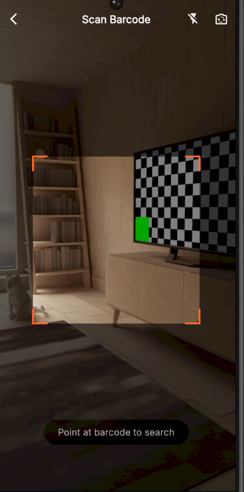</td>
  </tr>
  <tr>
    <td align="center">Products</td>
    <td align="center">Add Product</td>
    <td align="center">Edit Product</td>
    <td align="center">Barcode Scanner</td>
  </tr>
  <tr>
    <td>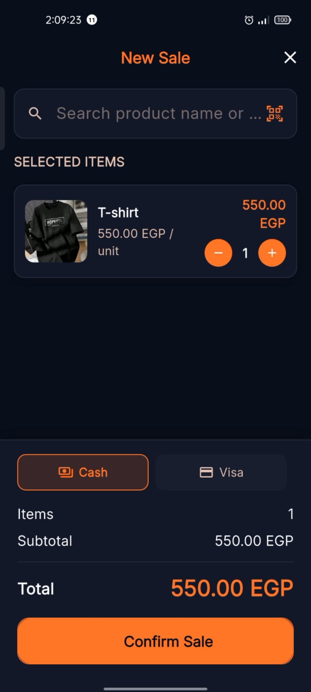</td>
    <td>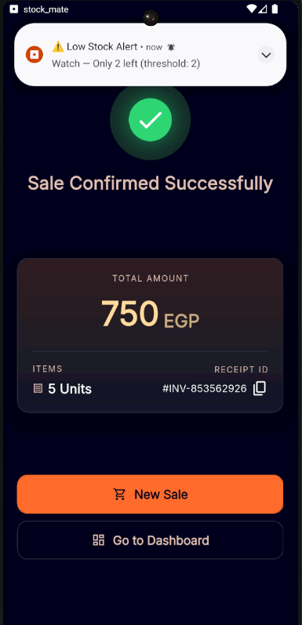</td>
    <td>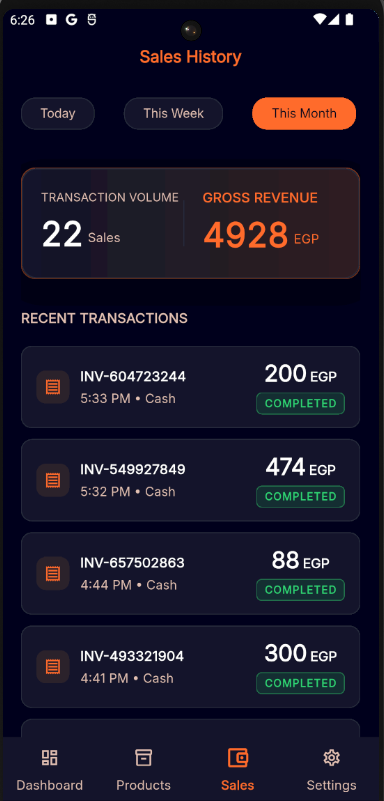</td>
  </tr>
  <tr>
    <td align="center">New Sale</td>
    <td align="center">Sale Confirmed</td>
    <td align="center">Sales History</td>
  </tr>
  <tr>
    <td>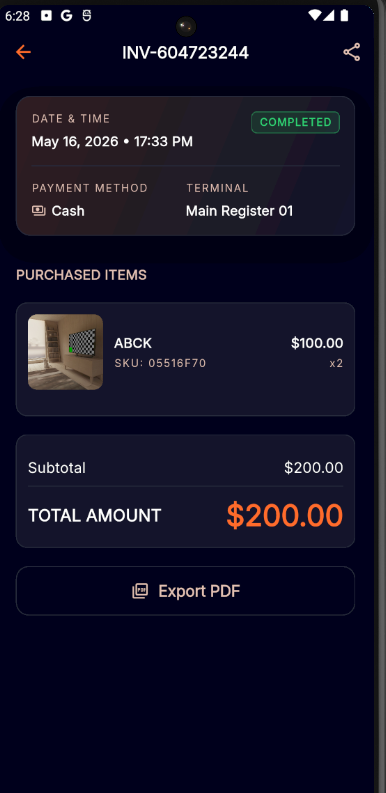</td>
    <td>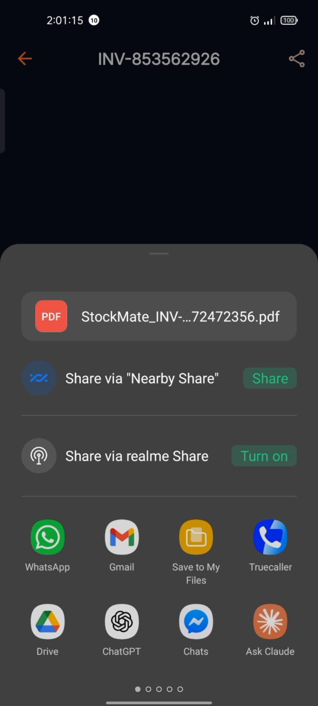</td>
    <td>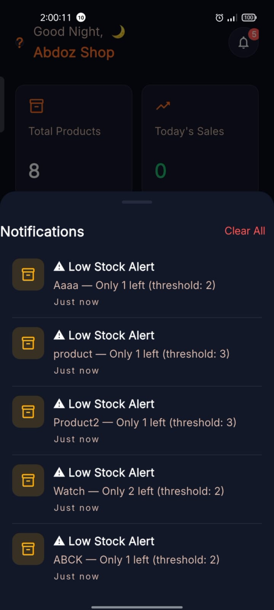</td>
    <td>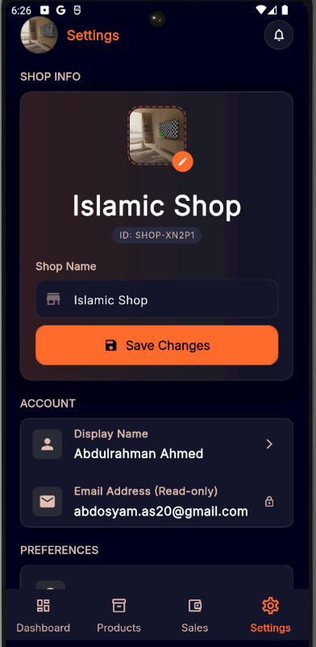</td>
  </tr>
  <tr>
    <td align="center">Sale Detail</td>
    <td align="center">Share Invoice</td>
    <td align="center">Notifications</td>
    <td align="center">Settings</td>
  </tr>
  <tr>
    <td>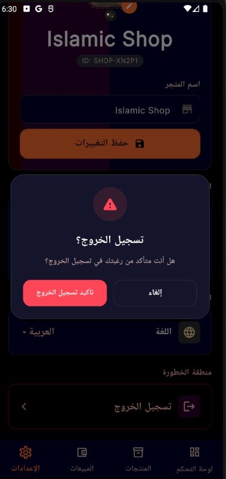</td>
  </tr>
  <tr>
    <td align="center">Logout</td>
  </tr>
</table>

---

## ✨ Features

### 🏪 Shop Management
- Shop logo upload with Supabase Storage
- Shop name and ID management
- Display name customization

### 📦 Inventory Management
- Add, edit, delete products with photos
- Barcode scanner integration
- Real-time stock tracking with Streams
- Low stock alerts with push notifications
- Category-based organization

### 💰 Sales Processing
- Invoice builder with product search
- Barcode scan to add products
- Multiple payment methods (Cash, Visa, InstaPay)
- Atomic batch writes (sale + stock update)
- PDF invoice export & share

### 📊 Analytics
- Real-time dashboard with stats
- Sales history with period filters (Today/Week/Month)
- Sale detail with complete item breakdown

### 🌍 Localization
- Full Arabic (RTL) and English (LTR) support
- Language switcher with Hive persistence
- locale-aware number and date formatting

### 🔔 Notifications
- Low stock push notifications
- Sale completion notifications
- In-app notification center with badge counter

---

## 🏗️ Architecture

```
lib/
├── core/
│   ├── constants/        # Firestore field names, Hive keys
│   ├── errors/           # Failure class hierarchy
│   ├── usecases/         # Abstract UseCase<T, Parameters>
│   ├── styles/           # AppStyles — responsive typography
│   ├── theme/            # AppColorsDarkMode, AppThemeDarkMode
│   ├── router/           # GoRouter + AppRoutes
│   ├── di/               # GetIt service locator
│   └── services/         # NotificationService
│
└── features/
    └── {feature}/
        ├── domain/       # Entities, Repos (abstract), UseCases
        ├── data/         # Models, DataSources, RepoImpl
        └── presentation/ # Cubit, State, Views, Widgets
```

### Clean Architecture Flow

```
UI → Cubit → UseCase → Repository (abstract)
                              ↓
                    RepositoryImpl → DataSource → Firebase/Supabase
```

---

## 🛠️ Tech Stack

| Category | Technology |
|----------|-----------|
| Framework | Flutter 3.x |
| Language | Dart 3.x |
| State Management | flutter_bloc (Cubit) |
| Navigation | go_router |
| DI | get_it |
| Backend | Firebase Firestore |
| Auth | Firebase Authentication |
| Storage | Supabase Storage |
| Local DB | Hive |
| Notifications | flutter_local_notifications |
| Charts | fl_chart |
| Image Cache | cached_network_image |
| PDF | pdf + printing |
| Barcode | mobile_scanner |

---

## 🚀 Getting Started

### Prerequisites

- Flutter SDK 3.x
- Dart SDK 3.x
- Firebase project with Firestore + Auth enabled
- Supabase project with `avatars` and `products` buckets

### Installation

```bash
# 1. Clone the repo
git clone https://github.com/your-username/stock_mate.git
cd stock_mate

# 2. Install dependencies
flutter pub get

# 3. Setup environment variables
cp .env.example .env
# Edit .env with your Supabase URL and anon key

# 4. Add Firebase config
# Place google-services.json in android/app/
# Place GoogleService-Info.plist in ios/Runner/

# 5. Run the app
flutter run
```

### Environment Variables

Create a `.env` file in the root:

```env
SUPABASE_URL=https://your-project.supabase.co
SUPABASE_ANON_KEY=your-anon-key
```

---

## 🔥 Firebase Setup

### Firestore Collections

```
users/{uid}
  ├── displayName: String
  ├── email: String
  ├── shopName: String
  ├── shopLogoUrl: String
  ├── shopId: String
  └── createdAt: Timestamp

products/{id}
  ├── name: String
  ├── barcode: String
  ├── category: String
  ├── buyPrice: Number
  ├── sellPrice: Number
  ├── quantity: Number
  ├── threshold: Number
  ├── imageUrl: String
  └── createdAt: Timestamp

sales/{id}
  ├── invoiceNumber: String
  ├── paymentMethod: String
  ├── totalAmount: Number
  ├── itemsCount: Number
  ├── createdAt: Timestamp
  └── items: Array
        └── {productId, productName, unitPrice, quantity, totalPrice}
```

### Firestore Rules

```javascript
rules_version = '2';
service cloud.firestore {
  match /databases/{database}/documents {
    match /users/{userId} {
      allow read, write: if request.auth != null 
                        && request.auth.uid == userId;
    }
    match /products/{productId} {
      allow read, write: if request.auth != null;
    }
    match /sales/{saleId} {
      allow read, write: if request.auth != null;
    }
  }
}
```

---

## 🗄️ Supabase Setup

### Storage Buckets

Create two **public** buckets:
- `avatars` — for shop logos
- `products` — for product images

### RLS Policies (SQL Editor)

```sql
-- Allow all authenticated operations
CREATE POLICY "Allow all operations"
ON storage.objects
FOR ALL
USING (true)
WITH CHECK (true);
```

---

## 📱 Supported Platforms

| Platform | Status |
|----------|--------|
| Android | ✅ Supported (API 21+) |
| iOS | ✅ Supported (iOS 13+) |
| Web | ❌ Not planned |
| Desktop | ❌ Not planned |

---

## 📄 License

This project is licensed under the MIT License.

---

## 👨‍💻 Author

**Abdelrahman Siam**
- LinkedIn: [linkedin.com/in/abdelrahman-siam](https://linkedin.com/in/abdelrahman-siam)
- GitHub: [github.com/abdelrahman-siam](https://github.com/abdelrahman-siam)

---

<div align="center">
  Made with ❤️ and Flutter
  <br/>
  ⭐ Star this repo if you found it helpful!
</div>
